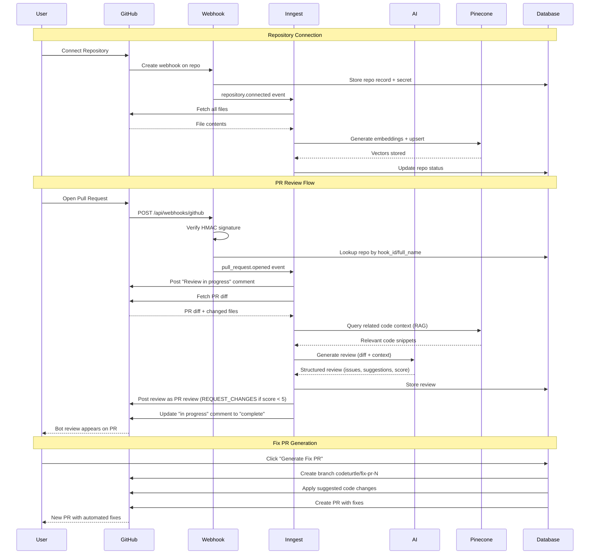

# CodeTurtle Architecture

## System Flow

## Components

| Component | Technology | Purpose |
|---|---|---|
| Frontend | Next.js 16 + React | Dashboard, settings, review display |
| Auth | Better Auth + GitHub OAuth | User authentication |
| Database | PostgreSQL + Prisma | User data, repos, reviews, subscriptions |
| Vector DB | Pinecone | Code embeddings for RAG |
| Background Jobs | Inngest | Async indexing and review generation |
| AI | Vercel AI SDK + Google Gemini | Code review generation |
| GitHub API | Octokit | Repo access, webhook management, PR comments |
| Billing | Polar | Subscription management |
| Rate Limiting | In-memory sliding window | Per-tier API limits |

## Key Design Decisions

1. **Inngest over cron**: Event-driven with retries and step-based execution for reliability
2. **RAG before review**: Queries Pinecone for related code context to give the AI full picture
3. **REQUEST_CHANGES for low scores**: Blocks merge when score < 5, forces attention to issues
4. **Two-step comment**: Posts "in progress" immediately, then overwrites with final review
5. **GitHub App for bot comments**: Uses installation tokens so reviews appear from the bot, not user's account
